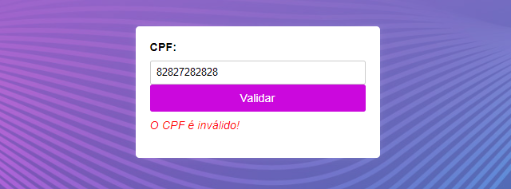
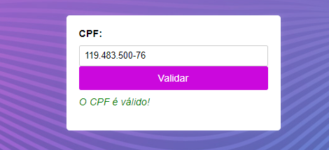
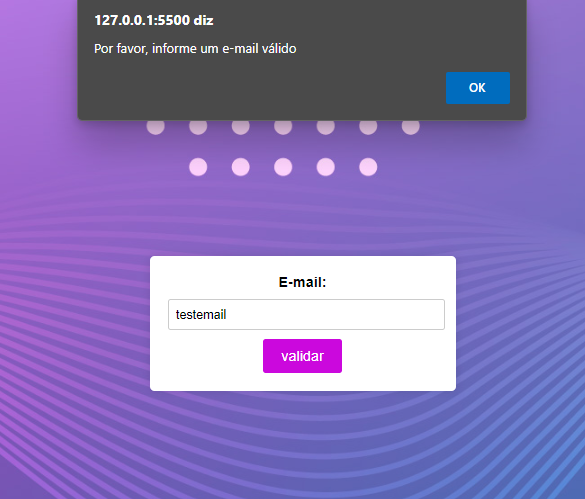
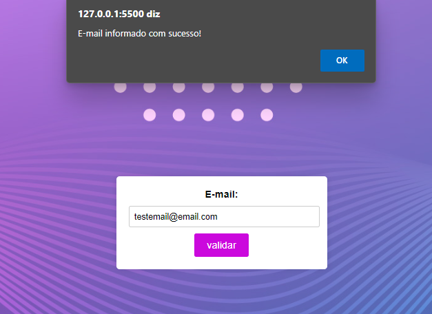

<h1 align="center">Validação de CPF e Email</h1>

  🚀  Este projeto valida CPFs e emails diretamente no navegador. Os usuários recebem feedback imediato após inserir os dados nos formulários correspondentes. Implementado com HTML, CSS e JavaScript.

---

## 📋 Sumário

- [Funcionalidades](#funcionalidades)
- [Validação do CPF](#Validação-do-CPF)
- [Validação do Email](#Validação-do-Email)
- [Tecnologias](#tecnologias)
- [Explanação de codigos](#Explanação-de-codigos)
- [Autor](#Autor)

---

## ✨ Funcionalidades

Validar o CPF e o cadastro do e-mail é muito importante para garantir a veracidade e confiabilidade dos dados. A verificação do CPF garante que o número fornecido está correto e corresponde ao cadastro original, evitando fraudes e erros. O e-mail garante que o formato do endereço esteja correto e pode evitar erros de comunicação. Essas validações melhoram a confiabilidade do cadastro e garantem a veracidade das informações e a boa interação com os usuários.

---

## Validação do CPF

### Método

### Explanação de codigos

## Validação do Email

### Método

  A página de verificação de e-mail usa HTML, JavaScript e CSS para criar uma interface funcional e estética. HTML Crie uma página usando um formulário contendo um campo de e-mail e um botão de envio. JavaScript valida o e-mail inserido: Se o e-mail estiver vazio ou não contiver os caracteres @ e . um aviso aparece informando que é necessário um e-mail válido. O conteúdo é centralizado, as cores aplicadas e as bordas arredondadas garantem uma boa experiência visual. Juntas, essas tecnologias garantem que as entradas de e-mail sejam devidamente validadas e exibidas de forma clara ao usuário.

### Explanação de codigos

/HTML/

  - Estrutura Básica: Define o tipo de documento e a estrutura HTML básica, com < head> para metadados e < body> para o conteúdo visível.
Meta Tags: Configuram a codificação de caracteres e a compatibilidade com diferentes navegadores.
Link para CSS: Conecta o arquivo de estilo externo cssemail.css que estiliza a página.
Formulário: Inclui um campo de entrada para e-mail e um botão de envio. O botão possui atributos onclick e onblur que chamam a função checarEmail para validar o e-mail inserido.
Parágrafo para Mensagem: Um elemento < p> com o ID email onde será exibido o resultado da validação do e-mail.
Inclusão do JavaScript: O arquivo email.js é incluído para fornecer a funcionalidade de validação.

/JAVASCRIPT/

  - Função checarEmail: Responsável pela validação do e-mail inserido pelo usuário.
Obtendo o Valor: A função obtém o valor do campo de e-mail usando document.forms[0].email.value.
Validação: Verifica se o e-mail está vazio ou não contém os caracteres essenciais (@ e .). Se não atender a essas condições, exibe um alerta informando o usuário sobre a necessidade de um e-mail válido e encerra a função.
Confirmação: Se o e-mail for considerado válido, exibe um alerta de sucesso.
Atualização da Página: O e-mail informado é exibido no parágrafo com o ID email.

/CSS/

  - stilo do Corpo (body):
Fonte e Layout: Define a fonte padrão e usa Flexbox para centralizar o formulário vertical e horizontalmente.
Imagem de Fundo: Aplica uma imagem de fundo e remove as margens padrão.
Estilo do Formulário (form):
Estilo Visual: Define o fundo branco, padding, bordas arredondadas e uma sombra leve para criar um visual moderno e destacado.
Estilo das Etiquetas (label):
Estilo do Texto: Exibe as etiquetas como blocos com margens inferiores e fonte em negrito para destaque.
Estilo do Campo de Entrada (input[type="text"]):
Largura e Padding: Ajusta a largura, o padding e o estilo da borda para tornar o campo de entrada mais utilizável e esteticamente agradável.
Estilo do Botão (input[type="submit"]):
Aparência do Botão: Define padding, tamanho da fonte, cor de fundo, e estilo de borda para o botão, além de um cursor pointer para indicar que é clicável.
Estilo da Mensagem (#email):
Estilo do Texto: Define a cor e o estilo da fonte para a mensagem que exibe o e-mail validado, garantindo que seja legível e visualmente agradável.
Resumo: O HTML define a estrutura e os elementos da página, o JavaScript adiciona a funcionalidade de validação do e-mail, e o CSS estiliza a página para torná-la visualmente atraente e fácil de usar. Juntas, essas partes criam uma interface interativa que valida e-mails e fornece feedback ao usuário de forma eficiente e agradável.

---

## Tecnologias

- Html5, CSS3 e Javascript

